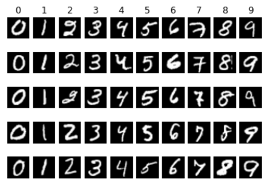

# DAVIAN TensorFLow
This project is created for DAVIAN TensorFLow study. 

## Tutorial index
#### Week 1 
(1) [Introduction to MNIST dataset](https://github.com/yunjey/tensorflow-tutorial/blob/master/week1/1.%20mnist_data_introduction.ipynb)

 

(2) [Feed forward neural network](https://github.com/yunjey/tensorflow-tutorial/blob/master/week1/3.%20feed_forward_neural_network.ipynb)

